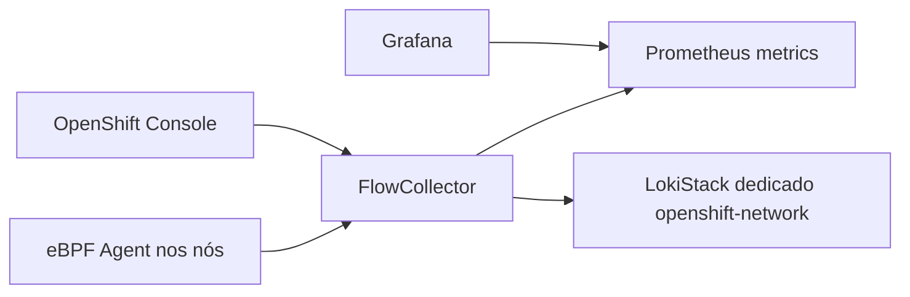

# network-observability-gitops

Network Observability Operator para OpenShift Local. O perfil CRC usa o
modelo `Direct`, indicado para clusters pequenos, amostragem conservadora e
métricas no Prometheus do OpenShift. Para a UI completa de fluxos, este repo
cria um LokiStack dedicado em `netobserv`, separado do LokiStack de logging.

Antes de sincronizar o app, gere o Secret S3 e o bucket do Loki dedicado:

```bash
cp .env.example .env
scripts/bootstrap-netobserv-loki.sh
```

```bash
oc apply -k overlays/desenvolvimento
```

Habilite somente após a stack principal estabilizar: o agente eBPF e o
processor consomem recursos adicionais e exigem `cluster-admin`.

Referência: documentação Network Observability do OpenShift 4.20.

As políticas adotadas para o ambiente local ficam em `docs/POLITICAS.md`. O
`FlowCollector` habilita `spec.networkPolicy.enable: true`, sampling conservador
e métricas com cardinalidade reduzida.

Manual passo a passo: [docs/COMO-USAR.md](docs/COMO-USAR.md).


## Arquitetura



O Network Observability coleta fluxos de rede do cluster. Ele permanece opcional
por exigir permissões elevadas e consumir recursos extras no CRC.

Interface gráfica: acesse o Console do OpenShift e navegue em
`Observe > Network Traffic`. O plugin é registrado como `ConsolePlugin`; não há
uma `Route` pública própria do NetObserv para o usuário final.

O LokiStack usado pelo NetObserv é dedicado. A documentação da Red Hat indica
separar o LokiStack de Network Observability do LokiStack de Logging. Por isso:

- logs de aplicação/infra/audit ficam no `loki-gitops` em `openshift-logging`;
- flows de rede ficam no `network-observability-gitops` em `netobserv`;
- o `FlowCollector` usa `spec.loki.mode: LokiStack`.

O gateway do LokiStack usa autenticação/autorização OpenShift e precisa validar tokens
e autorizações.
Por isso o repositório cria uma permissão mínima para o ServiceAccount
`netobserv/loki-gateway` executar `tokenreviews.authentication.k8s.io/create`
e `subjectaccessreviews.authorization.k8s.io/create`. Sem essa permissão, o
gateway registra mensagens como `tokenreviews ... is forbidden` ou
`subjectaccessreviews ... is forbidden` ao receber consultas autenticadas.

No CRC o LokiStack dedicado usa perfil reduzido para caber no cluster local.
O Operator pode mostrar o warning `InsufficientIngesterReplicas` quando existe
apenas um ingester. Isso indica ausência de alta disponibilidade durante restart
do ingester, não falha funcional de ingestão em laboratório. Para remover o
warning em ambiente com mais recursos, aumente réplicas de ingester ou use um
tamanho de LokiStack apropriado; no CRC o padrão favorece economia de CPU/RAM.

O `OperatorGroup` é intencionalmente criado sem `spec.targetNamespaces`.
O Network Observability Operator declara suporte apenas ao install mode
`AllNamespaces`; configurar `targetNamespaces` força `OwnNamespace` e faz o CSV
falhar com `OwnNamespace InstallModeType not supported`.

## Ambientes e validação

```bash
oc kustomize overlays/desenvolvimento >/tmp/netobserv-dev.yaml
oc kustomize overlays/aceite >/tmp/netobserv-aceite.yaml
oc kustomize overlays/producao >/tmp/netobserv-prod.yaml
```

`oc apply --dry-run=client -k ...` requer o CRD `FlowCollector` instalado; se o
Operator ainda não estiver no cluster, valide com `oc kustomize`. Veja
`docs/AMBIENTES.md`.

## Secrets

| Secret | Namespace | Chaves | Consumidor |
|---|---|---|---|
| `netobserv-loki-s3` | `netobserv` | `access_key_id`, `access_key_secret`, `bucketnames`, `endpoint`, `region` | `LokiStack/netobserv/loki` |

Criação idempotente recomendada:

```bash
scripts/bootstrap-netobserv-loki.sh
```

O script lê `openshift-logging/minio-credentials`, cria o bucket `netobserv` no
MinIO local e aplica o Secret `netobserv/netobserv-loki-s3`. Nenhuma credencial
real é versionada.
