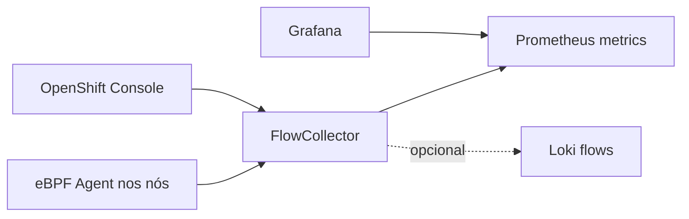

# network-observability-gitops

Network Observability Operator para OpenShift Local. O perfil CRC usa o
modelo `Direct`, indicado para clusters pequenos, amostragem conservadora e
métricas no Prometheus do OpenShift. Loki não é obrigatório.

```bash
oc apply -k overlays/desenvolvimento
```

Habilite somente após a stack principal estabilizar: o agente eBPF e o
processor consomem recursos adicionais e exigem `cluster-admin`.

Referência: documentação Network Observability do OpenShift 4.20.

As políticas adotadas para o ambiente local ficam em `docs/POLITICAS.md`. O
`FlowCollector` habilita `spec.networkPolicy.enable: true`, sampling conservador
e métricas com cardinalidade reduzida.

Manual passo a passo: [docs/COMO-USAR.md](docs/COMO-USAR.md).


## Arquitetura



O Network Observability coleta fluxos de rede do cluster. Ele permanece opcional
por exigir permissões elevadas e consumir recursos extras no CRC.

O `OperatorGroup` é intencionalmente criado sem `spec.targetNamespaces`.
O Network Observability Operator declara suporte apenas ao install mode
`AllNamespaces`; configurar `targetNamespaces` força `OwnNamespace` e faz o CSV
falhar com `OwnNamespace InstallModeType not supported`.

## Ambientes e validação

```bash
oc kustomize overlays/desenvolvimento >/tmp/netobserv-dev.yaml
oc kustomize overlays/aceite >/tmp/netobserv-aceite.yaml
oc kustomize overlays/producao >/tmp/netobserv-prod.yaml
```

`oc apply --dry-run=client -k ...` requer o CRD `FlowCollector` instalado; se o
Operator ainda não estiver no cluster, valide com `oc kustomize`. Veja
`docs/AMBIENTES.md`.
